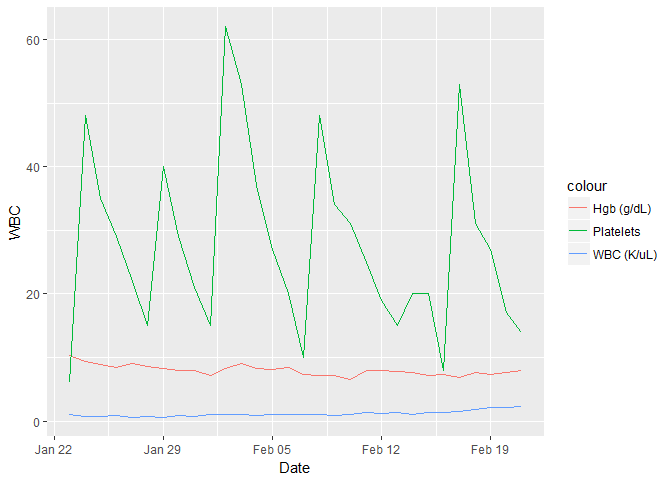
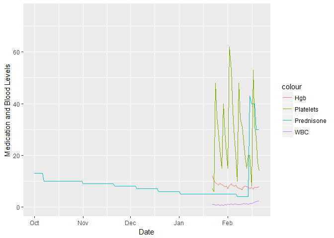
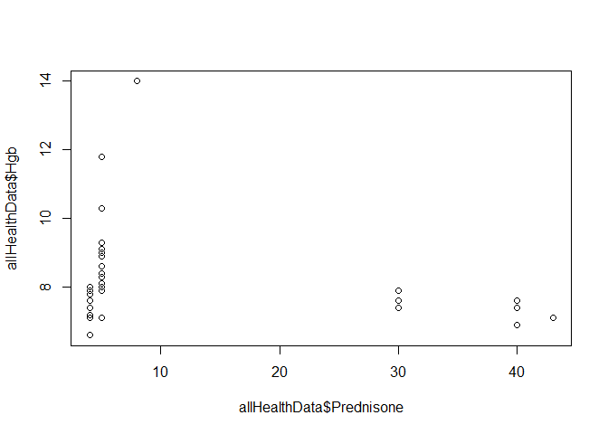
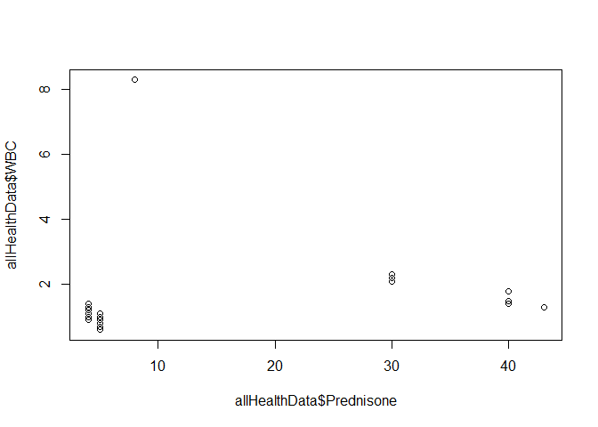

Analyzing Real-time EHR Data with Linear and Time Series Regression
================
Gregory Maly
February 26, 2018

*This paper is a working draft, and may include incomplete thoughts or spelling errors. If the paper was shared with you, it was done so in hopes of getting feedback from those with expertise in fields such as hematology, pharmaceuticals, or statistics. [Click here](https://docs.google.com/spreadsheets/d/1eMz98RVYkRLEgwIygZfmTSckwZequpTkD2qos1c87zs/edit?usp=sharing) to access the full health data file set associated with this paper. All code is available on github Please direct inquiries to [Greg Maly](mailto:gamaly@gmail.com).*

Introduction
============

Increased collection and storage of patient medical records in combination with advances in computer processing power offer new methods of analyzing patient health records in near real-time. A 2016 journal article published in the US National Library of Medicine at the National Institute of Health examines the possibility of using lagged linear correlation, lagged regression, granger causality, and vector autogression to uncover associations in electronic health record (EHR) data. A second 2016 paper written in the same journal examines adaptive forecasting models from irregularly sampled multivariate clinical data. Both papers examine the same concept, which is to use multivariate statistical analysis to understand hidden correlated factors in electronic health record data. These methods may offer insights that augment the expertise of clinical doctors.

The question at hand is how to implement these methods for real-time analysis in single patients. This living research paper will focus on one individual who has agreed to open their real-time EHR data for analysis.

The paper is written as an R Markdown file running in R 3.4.3. All R syntax is included throughout the document.

The Case: Low Red Blood Cell, White Blood Cell, and Platelet Counts
===================================================================

This research document is an evolving attempt to analyze real-time EHR data for a current patient. The patient was admitted to the hospital and held for four weeks after low white blood cell, red blood cell, and platelet levels were discovered. As of the writing of this document, the cause of his poor blood health is still unknown.

The current theory is that medications caused bone marrow to stop producing healthy blood. This document will seek to analyze correlations between his intake of medications and white, red and platelet counts.

Background: Blood Health Over Time
----------------------------------

The following graph shows his daily blood cell counts starting on January 22. As of Febuary 24, blood was drawn and tested three days a week.

``` r
library(ggplot2)
load(file="allHealthData.Rdata")
ggplot(data=subset(allHealthData, Date > as.Date("2018-1-22")),
 aes(Date, group=1)) + 
  geom_line(aes(y = `WBC`, color = "WBC (K/uL)" )) +
  geom_line(aes(y = `Hgb`, color="Hgb (g/dL)")) +
  geom_line(aes(y=`Platelets`, color="Platelets"))
```



White Blood Cell Count Summary Stats
------------------------------------

``` r
summary(allHealthData$`WBC`)
```

    ##    Min. 1st Qu.  Median    Mean 3rd Qu.    Max.    NA's 
    ##   0.600   0.900   1.050   1.375   1.325   8.300     112

Red Blood Cell Count Summary Statistics
---------------------------------------

``` r
summary(allHealthData$`Hgb`)
```

    ##    Min. 1st Qu.  Median    Mean 3rd Qu.    Max.    NA's 
    ##   6.600   7.400   7.950   8.291   8.450  14.000     112

Platelet Levels summary statistics
----------------------------------

``` r
summary(allHealthData$`Platelets`)
```

    ##    Min. 1st Qu.  Median    Mean 3rd Qu.    Max.    NA's 
    ##    6.00   16.50   26.00   35.28   35.50  291.00     112

Hypothesis: Medication intake is correlated with blood health
=============================================================

The current hypothesis is that medications caused a drop in blood cell counts. This includes two possibilities.

1.  Medication negatively interacted with the blood system, causing damage to bone marrow function.
2.  Medication caused the body to forget how to develop healthy blood cells.

If medications are believed to cause poor blood health, then we should be able to see a correlation between the intake of individual meducations and blood health. However, given limited available data, there are multiple scenarios that may not be visible.

Medication Overview
-------------------

1.  **Acetazolamide:** The patient took Acetazolamide for approximtely six weeks in October and November 2017. Blood samples were found to be normal on December 4. Therefore there is little reason to believe a correlation between blood health and Azetazolamide.
2.  **Methazolamide:** The patient took Methazolamide from December 6 2017 - January 4 2018. Blood samples were found to be normal in the days prior to taking the drug, and unhealthy in the weeks after finishing the course of medication. There is reason to believe Methazolamide may be correlated with poor blood health, but there may be insufficient data to see a correlation in a single patient.
3.  **Cefadroxil** The patient took Cefadroxil in the days prior to being admitted to the hospital. Blood was found to be normal the month before taking Cefadroxil, but unhealthy shortly after first taking it. The patient stopped taking the medication once admitted to the hospital. There is reson to believe Cefadroxil intake is correlated with unhealthy blood levels, but there may be insufficent data to see a correlation in a single patient.
4.  **Prednisone:** Prednisone can lead to an incease in white and red blood cell counts during use, but has been shown to reduce the number of health blood cells as a patient reduces daily levels of intake. If this hypothesis were to be true, we would expect to see a reduction in prednisone levels to correlate with a reduction in healthy blood cells. Four months of prednisone use were recorded, while only four weeks of blood tests have been recorded.

This section will use standard multiple regression methods to test medication levels against daily blood tests of white blood cells, red blood cells, and platelet levels. Because this data is temporal, subsequent sections will use time series tests to look for patterns over time.

Test 1: WBC as Dependent Variable. All medications as Indepedent Variables
--------------------------------------------------------------------------

``` r
WbcMulti <- lm(WBC ~ Triamterene + Bisoprolol + aspirin + Prednisone + Fosamax + `Vitamin D-3` + Acetazolamide + Methazolamide + Cefadroxil + Sulfamethoxazole, data = allHealthData)
summary(WbcMulti)
```

    ## 
    ## Call:
    ## lm(formula = WBC ~ Triamterene + Bisoprolol + aspirin + Prednisone + 
    ##     Fosamax + `Vitamin D-3` + Acetazolamide + Methazolamide + 
    ##     Cefadroxil + Sulfamethoxazole, data = allHealthData)
    ## 
    ## Residuals:
    ##      Min       1Q   Median       3Q      Max 
    ## -0.56831 -0.20006  0.00000  0.09994  0.72872 
    ## 
    ## Coefficients: (6 not defined because of singularities)
    ##                    Estimate Std. Error t value Pr(>|t|)    
    ## (Intercept)       8.858e-01  7.984e-02  11.095 1.46e-11 ***
    ## Triamterene      -1.000e-01  4.541e-01  -0.220    0.827    
    ## Bisoprolol               NA         NA      NA       NA    
    ## aspirin           7.331e+00  5.597e-01  13.100 3.25e-13 ***
    ## Prednisone        2.285e-02  4.337e-03   5.268 1.48e-05 ***
    ## Fosamax                  NA         NA      NA       NA    
    ## `Vitamin D-3`            NA         NA      NA       NA    
    ## Acetazolamide            NA         NA      NA       NA    
    ## Methazolamide            NA         NA      NA       NA    
    ## Cefadroxil       -6.039e-05  3.281e-01   0.000    1.000    
    ## Sulfamethoxazole         NA         NA      NA       NA    
    ## ---
    ## Signif. codes:  0 '***' 0.001 '**' 0.01 '*' 0.05 '.' 0.1 ' ' 1
    ## 
    ## Residual standard error: 0.3211 on 27 degrees of freedom
    ##   (112 observations deleted due to missingness)
    ## Multiple R-squared:  0.9496, Adjusted R-squared:  0.9421 
    ## F-statistic: 127.2 on 4 and 27 DF,  p-value: < 2.2e-16

Test 2: Hgb as Dependent Variable. All medications as Indepedent Variables
--------------------------------------------------------------------------

``` r
WbcMulti <- lm(Hgb ~ Triamterene + Bisoprolol + aspirin + Prednisone + Fosamax + `Vitamin D-3` + Acetazolamide + Methazolamide + Cefadroxil + Sulfamethoxazole, data = allHealthData)
summary(WbcMulti)
```

    ## 
    ## Call:
    ## lm(formula = Hgb ~ Triamterene + Bisoprolol + aspirin + Prednisone + 
    ##     Fosamax + `Vitamin D-3` + Acetazolamide + Methazolamide + 
    ##     Cefadroxil + Sulfamethoxazole, data = allHealthData)
    ## 
    ## Residuals:
    ##     Min      1Q  Median      3Q     Max 
    ## -1.4696 -0.2048  0.0000  0.2798  1.2505 
    ## 
    ## Coefficients: (6 not defined because of singularities)
    ##                   Estimate Std. Error t value Pr(>|t|)    
    ## (Intercept)       8.150281   0.158998  51.260  < 2e-16 ***
    ## Triamterene       1.500000   0.904354   1.659  0.10876    
    ## Bisoprolol              NA         NA      NA       NA    
    ## aspirin           4.511029   1.114553   4.047  0.00039 ***
    ## Prednisone       -0.020164   0.008637  -2.334  0.02726 *  
    ## Fosamax                 NA         NA      NA       NA    
    ## `Vitamin D-3`           NA         NA      NA       NA    
    ## Acetazolamide           NA         NA      NA       NA    
    ## Methazolamide           NA         NA      NA       NA    
    ## Cefadroxil        2.250538   0.653408   3.444  0.00188 ** 
    ## Sulfamethoxazole        NA         NA      NA       NA    
    ## ---
    ## Signif. codes:  0 '***' 0.001 '**' 0.01 '*' 0.05 '.' 0.1 ' ' 1
    ## 
    ## Residual standard error: 0.6395 on 27 degrees of freedom
    ##   (112 observations deleted due to missingness)
    ## Multiple R-squared:  0.8341, Adjusted R-squared:  0.8096 
    ## F-statistic: 33.95 on 4 and 27 DF,  p-value: 3.591e-10

Test 3: Platelets as Dependent Variable. All medications as Indepedent Variables
--------------------------------------------------------------------------------

``` r
WbcMulti <- lm(Platelets ~ Triamterene + Bisoprolol + aspirin + Prednisone + Fosamax + `Vitamin D-3` + Acetazolamide + Methazolamide + Cefadroxil + Sulfamethoxazole, data = allHealthData)
summary(WbcMulti)
```

    ## 
    ## Call:
    ## lm(formula = Platelets ~ Triamterene + Bisoprolol + aspirin + 
    ##     Prednisone + Fosamax + `Vitamin D-3` + Acetazolamide + Methazolamide + 
    ##     Cefadroxil + Sulfamethoxazole, data = allHealthData)
    ## 
    ## Residuals:
    ##     Min      1Q  Median      3Q     Max 
    ## -19.570  -9.468  -0.434   5.757  32.566 
    ## 
    ## Coefficients: (6 not defined because of singularities)
    ##                  Estimate Std. Error t value Pr(>|t|)    
    ## (Intercept)       30.1146     3.4985   8.608 3.19e-09 ***
    ## Triamterene        1.0000    19.8990   0.050    0.960    
    ## Bisoprolol             NA         NA      NA       NA    
    ## aspirin          260.9744    24.5241  10.642 3.68e-11 ***
    ## Prednisone        -0.1361     0.1901  -0.716    0.480    
    ## Fosamax                NA         NA      NA       NA    
    ## `Vitamin D-3`          NA         NA      NA       NA    
    ## Acetazolamide          NA         NA      NA       NA    
    ## Methazolamide          NA         NA      NA       NA    
    ## Cefadroxil       -23.4340    14.3773  -1.630    0.115    
    ## Sulfamethoxazole       NA         NA      NA       NA    
    ## ---
    ## Signif. codes:  0 '***' 0.001 '**' 0.01 '*' 0.05 '.' 0.1 ' ' 1
    ## 
    ## Residual standard error: 14.07 on 27 degrees of freedom
    ##   (112 observations deleted due to missingness)
    ## Multiple R-squared:  0.9276, Adjusted R-squared:  0.9169 
    ## F-statistic:  86.5 on 4 and 27 DF,  p-value: 5.448e-15

Results
=======

``` r
library(ggplot2)
ggplot(allHealthData, aes(Date, group=1)) + 
  geom_line(aes(y=Prednisone, color = "Prednisone")) +
  geom_line(aes(y =WBC, color = "WBC" )) +
  geom_line(aes(y =Hgb, color="Hgb")) +
  geom_line(aes(y=Platelets, color="Platelets")) +
  ylim(0, 75) + 
  ylab("Medication and Blood Levels")
```



### Test 2: Scatterplot of Predisone intake vs Hemoglobin

One+One=2

``` r
plot(allHealthData$Hgb~allHealthData$Prednisone)
```



``` r
PredisoneIV <- lm(Hgb ~ Prednisone, data=allHealthData)
summary(PredisoneIV)
```

    ## 
    ## Call:
    ## lm(formula = Hgb ~ Prednisone, data = allHealthData)
    ## 
    ## Residuals:
    ##     Min      1Q  Median      3Q     Max 
    ## -1.9298 -0.6063 -0.1985  0.1854  5.5952 
    ## 
    ## Coefficients:
    ##             Estimate Std. Error t value Pr(>|t|)    
    ## (Intercept)  8.65471    0.33636  25.730   <2e-16 ***
    ## Prednisone  -0.03123    0.01908  -1.637    0.112    
    ## ---
    ## Signif. codes:  0 '***' 0.001 '**' 0.01 '*' 0.05 '.' 0.1 ' ' 1
    ## 
    ## Residual standard error: 1.427 on 30 degrees of freedom
    ##   (112 observations deleted due to missingness)
    ## Multiple R-squared:  0.08197,    Adjusted R-squared:  0.05137 
    ## F-statistic: 2.679 on 1 and 30 DF,  p-value: 0.1121

### Test 2: Scatterplot of Prednisone intake vs White Blood Cell Count

``` r
plot(allHealthData$WBC ~allHealthData$Prednisone)
```



``` r
PredisoneIV_WBC <- lm(WBC ~ Prednisone, data=allHealthData)
summary(PredisoneIV_WBC)
```

    ## 
    ## Call:
    ## lm(formula = WBC ~ Prednisone, data = allHealthData)
    ## 
    ## Residuals:
    ##     Min      1Q  Median      3Q     Max 
    ## -0.6536 -0.4074 -0.2445 -0.1245  6.9917 
    ## 
    ## Coefficients:
    ##             Estimate Std. Error t value Pr(>|t|)    
    ## (Intercept)  1.16238    0.31436   3.698  0.00087 ***
    ## Prednisone   0.01824    0.01784   1.023  0.31462    
    ## ---
    ## Signif. codes:  0 '***' 0.001 '**' 0.01 '*' 0.05 '.' 0.1 ' ' 1
    ## 
    ## Residual standard error: 1.334 on 30 degrees of freedom
    ##   (112 observations deleted due to missingness)
    ## Multiple R-squared:  0.03369,    Adjusted R-squared:  0.001479 
    ## F-statistic: 1.046 on 1 and 30 DF,  p-value: 0.3146

This analysis will use a time series regression model to identify possible correlations between medication intake and blood levels.

``` r
library(forecast)
library(lmtest)
```

    ## Loading required package: zoo

    ## 
    ## Attaching package: 'zoo'

    ## The following objects are masked from 'package:base':
    ## 
    ##     as.Date, as.Date.numeric

``` r
#Prepared Differenced Time Series Data
dprednisone <- diff(allHealthData$Prednisone)
dWBC <- diff(allHealthData$WBC)
dHgb <- diff(allHealthData$Hgb)
dPlatelets <- diff(allHealthData$Platelets)
grangertest(dprednisone ~ dWBC, order=4)
```

    ## Granger causality test
    ## 
    ## Model 1: dprednisone ~ Lags(dprednisone, 1:4) + Lags(dWBC, 1:4)
    ## Model 2: dprednisone ~ Lags(dprednisone, 1:4)
    ##   Res.Df Df      F Pr(>F)
    ## 1     17                 
    ## 2     21 -4 1.5619 0.2296

Implications for EHR Databases
==============================

*To be written: This section will discuss electronic health record systems such as DHIS 2, and the possibility of including this type of analysis for all individual health patient records.*

Annex
=====

Full Data Table
---------------

``` r
library(knitr)
kable(allHealthData)
```

| Date       |  Triamterene|  Bisoprolol|  aspirin|  Prednisone|  Fosamax|  Vitamin D-3|  Acetazolamide|  Methazolamide|  Cefadroxil|  Sulfamethoxazole|  WBC|   Hgb|  Platelets|  RBC Transfusion|  Platelet Transfusion|
|:-----------|------------:|-----------:|--------:|-----------:|--------:|------------:|--------------:|--------------:|-----------:|-----------------:|----:|-----:|----------:|----------------:|---------------------:|
| 2017-10-01 |            1|           1|        1|          13|        0|            1|              0|              0|           0|                 0|   NA|    NA|         NA|                0|                     0|
| 2017-10-02 |            1|           1|        1|          13|        0|            1|              0|              0|           0|                 0|   NA|    NA|         NA|                0|                     0|
| 2017-10-03 |            1|           1|        1|          13|        0|            1|              0|              0|           0|                 0|   NA|    NA|         NA|                0|                     0|
| 2017-10-04 |            1|           1|        1|          13|        0|            1|              0|              0|           0|                 0|   NA|    NA|         NA|                0|                     0|
| 2017-10-05 |            1|           1|        1|          13|        0|            1|              0|              0|           0|                 0|   NA|    NA|         NA|                0|                     0|
| 2017-10-06 |            1|           1|        1|          13|        0|            1|              1|              0|           0|                 0|   NA|    NA|         NA|                0|                     0|
| 2017-10-07 |            1|           1|        1|          10|        0|            1|              1|              0|           0|                 0|   NA|    NA|         NA|                0|                     0|
| 2017-10-08 |            1|           1|        1|          10|        0|            1|              1|              0|           0|                 0|   NA|    NA|         NA|                0|                     0|
| 2017-10-09 |            1|           1|        1|          10|        0|            1|              1|              0|           0|                 0|   NA|    NA|         NA|                0|                     0|
| 2017-10-10 |            1|           1|        1|          10|        0|            1|              1|              0|           0|                 0|   NA|    NA|         NA|                0|                     0|
| 2017-10-11 |            1|           1|        1|          10|        0|            1|              1|              0|           0|                 0|   NA|    NA|         NA|                0|                     0|
| 2017-10-12 |            1|           1|        1|          10|        0|            1|              1|              0|           0|                 0|   NA|    NA|         NA|                0|                     0|
| 2017-10-13 |            1|           1|        1|          10|        0|            1|              1|              0|           0|                 0|   NA|    NA|         NA|                0|                     0|
| 2017-10-14 |            1|           1|        1|          10|        0|            1|              1|              0|           0|                 0|   NA|    NA|         NA|                0|                     0|
| 2017-10-15 |            1|           1|        1|          10|        0|            1|              1|              0|           0|                 0|   NA|    NA|         NA|                0|                     0|
| 2017-10-16 |            1|           1|        1|          10|        0|            1|              1|              0|           0|                 0|   NA|    NA|         NA|                0|                     0|
| 2017-10-17 |            1|           1|        1|          10|        0|            1|              1|              0|           0|                 0|   NA|    NA|         NA|                0|                     0|
| 2017-10-18 |            1|           1|        1|          10|        0|            1|              1|              0|           0|                 0|   NA|    NA|         NA|                0|                     0|
| 2017-10-19 |            1|           1|        1|          10|        0|            1|              1|              0|           0|                 0|   NA|    NA|         NA|                0|                     0|
| 2017-10-20 |            1|           1|        1|          10|        0|            1|              1|              0|           0|                 0|   NA|    NA|         NA|                0|                     0|
| 2017-10-21 |            1|           1|        1|          10|        0|            1|              1|              0|           0|                 0|   NA|    NA|         NA|                0|                     0|
| 2017-10-22 |            1|           1|        1|          10|        0|            1|              1|              0|           0|                 0|   NA|    NA|         NA|                0|                     0|
| 2017-10-23 |            1|           1|        1|          10|        0|            1|              1|              0|           0|                 0|   NA|    NA|         NA|                0|                     0|
| 2017-10-24 |            1|           1|        1|          10|        0|            1|              1|              0|           0|                 0|   NA|    NA|         NA|                0|                     0|
| 2017-10-25 |            1|           1|        1|          10|        0|            1|              1|              0|           0|                 0|   NA|    NA|         NA|                0|                     0|
| 2017-10-26 |            1|           1|        1|          10|        0|            1|              1|              0|           0|                 0|   NA|    NA|         NA|                0|                     0|
| 2017-10-27 |            1|           1|        1|          10|        0|            1|              1|              0|           0|                 0|   NA|    NA|         NA|                0|                     0|
| 2017-10-28 |            1|           1|        1|          10|        0|            1|              1|              0|           0|                 0|   NA|    NA|         NA|                0|                     0|
| 2017-10-29 |            1|           1|        1|          10|        0|            1|              1|              0|           0|                 0|   NA|    NA|         NA|                0|                     0|
| 2017-10-30 |            1|           1|        1|          10|        0|            1|              1|              0|           0|                 0|   NA|    NA|         NA|                0|                     0|
| 2017-10-31 |            1|           1|        1|          10|        0|            1|              1|              0|           0|                 0|   NA|    NA|         NA|                0|                     0|
| 2017-11-01 |            1|           1|        1|           9|        0|            1|              1|              0|           0|                 0|   NA|    NA|         NA|                0|                     0|
| 2017-11-02 |            1|           1|        1|           9|        0|            1|              1|              0|           0|                 0|   NA|    NA|         NA|                0|                     0|
| 2017-11-03 |            1|           1|        1|           9|        0|            1|              1|              0|           0|                 0|   NA|    NA|         NA|                0|                     0|
| 2017-11-04 |            1|           1|        1|           9|        0|            1|              1|              0|           0|                 0|   NA|    NA|         NA|                0|                     0|
| 2017-11-05 |            1|           1|        1|           9|        0|            1|              1|              0|           0|                 0|   NA|    NA|         NA|                0|                     0|
| 2017-11-06 |            1|           1|        1|           9|        0|            1|              1|              0|           0|                 0|   NA|    NA|         NA|                0|                     0|
| 2017-11-07 |            1|           1|        1|           9|        0|            1|              1|              0|           0|                 0|   NA|    NA|         NA|                0|                     0|
| 2017-11-08 |            1|           1|        1|           9|        0|            1|              1|              0|           0|                 0|   NA|    NA|         NA|                0|                     0|
| 2017-11-09 |            1|           1|        1|           9|        0|            1|              1|              0|           0|                 0|   NA|    NA|         NA|                0|                     0|
| 2017-11-10 |            1|           1|        1|           9|        0|            1|              1|              0|           0|                 0|   NA|    NA|         NA|                0|                     0|
| 2017-11-11 |            1|           1|        1|           9|        0|            1|              1|              0|           0|                 0|   NA|    NA|         NA|                0|                     0|
| 2017-11-12 |            1|           1|        1|           9|        0|            1|              1|              0|           0|                 0|   NA|    NA|         NA|                0|                     0|
| 2017-11-13 |            1|           1|        1|           9|        0|            1|              1|              0|           0|                 0|   NA|    NA|         NA|                0|                     0|
| 2017-11-14 |            1|           1|        1|           9|        0|            1|              1|              0|           0|                 0|   NA|    NA|         NA|                0|                     0|
| 2017-11-15 |            1|           1|        1|           9|        0|            1|              1|              0|           0|                 0|   NA|    NA|         NA|                0|                     0|
| 2017-11-16 |            1|           1|        1|           9|        0|            1|              1|              0|           0|                 0|   NA|    NA|         NA|                0|                     0|
| 2017-11-17 |            1|           1|        1|           9|        0|            1|              1|              0|           0|                 0|   NA|    NA|         NA|                0|                     0|
| 2017-11-18 |            1|           1|        1|           9|        0|            1|              1|              0|           0|                 0|   NA|    NA|         NA|                0|                     0|
| 2017-11-19 |            1|           1|        1|           9|        0|            1|              1|              0|           0|                 0|   NA|    NA|         NA|                0|                     0|
| 2017-11-20 |            1|           1|        1|           9|        0|            1|              1|              0|           0|                 0|   NA|    NA|         NA|                0|                     0|
| 2017-11-21 |            1|           1|        1|           8|        0|            1|              1|              0|           0|                 0|   NA|    NA|         NA|                0|                     0|
| 2017-11-22 |            1|           1|        1|           8|        0|            1|              1|              0|           0|                 0|   NA|    NA|         NA|                0|                     0|
| 2017-11-23 |            1|           1|        1|           8|        0|            1|              1|              0|           0|                 0|   NA|    NA|         NA|                0|                     0|
| 2017-11-24 |            1|           1|        1|           8|        0|            1|              1|              0|           0|                 0|   NA|    NA|         NA|                0|                     0|
| 2017-11-25 |            1|           1|        1|           8|        0|            1|              1|              0|           0|                 0|   NA|    NA|         NA|                0|                     0|
| 2017-11-26 |            1|           1|        1|           8|        0|            1|              1|              0|           0|                 0|   NA|    NA|         NA|                0|                     0|
| 2017-11-27 |            1|           1|        1|           8|        0|            1|              1|              0|           0|                 0|   NA|    NA|         NA|                0|                     0|
| 2017-11-28 |            1|           1|        1|           8|        0|            1|              0|              0|           0|                 0|   NA|    NA|         NA|                0|                     0|
| 2017-11-29 |            1|           1|        1|           8|        0|            1|              0|              0|           0|                 0|   NA|    NA|         NA|                0|                     0|
| 2017-11-30 |            1|           1|        1|           8|        0|            1|              0|              0|           0|                 0|   NA|    NA|         NA|                0|                     0|
| 2017-12-01 |            1|           1|        1|           8|        0|            1|              0|              0|           0|                 0|   NA|    NA|         NA|                0|                     0|
| 2017-12-02 |            1|           1|        1|           8|        0|            1|              0|              0|           0|                 0|   NA|    NA|         NA|                0|                     0|
| 2017-12-03 |            1|           1|        1|           8|        0|            1|              0|              0|           0|                 0|   NA|    NA|         NA|                0|                     0|
| 2017-12-04 |            1|           1|        1|           8|        0|            1|              0|              0|           0|                 0|  8.3|  14.0|        291|                0|                     0|
| 2017-12-05 |            1|           1|        1|           7|        0|            1|              0|              0|           0|                 0|   NA|    NA|         NA|                0|                     0|
| 2017-12-06 |            1|           1|        1|           7|        0|            1|              0|              0|           0|                 0|   NA|    NA|         NA|                0|                     0|
| 2017-12-07 |            1|           1|        1|           7|        0|            1|              0|              1|           0|                 0|   NA|    NA|         NA|                0|                     0|
| 2017-12-08 |            1|           1|        1|           7|        0|            1|              0|              1|           0|                 0|   NA|    NA|         NA|                0|                     0|
| 2017-12-09 |            1|           1|        1|           7|        0|            1|              0|              1|           0|                 0|   NA|    NA|         NA|                0|                     0|
| 2017-12-10 |            1|           1|        1|           7|        0|            1|              0|              1|           0|                 0|   NA|    NA|         NA|                0|                     0|
| 2017-12-11 |            1|           1|        1|           7|        0|            1|              0|              1|           0|                 0|   NA|    NA|         NA|                0|                     0|
| 2017-12-12 |            1|           1|        1|           7|        0|            1|              0|              1|           0|                 0|   NA|    NA|         NA|                0|                     0|
| 2017-12-13 |            1|           1|        1|           7|        0|            1|              0|              1|           0|                 0|   NA|    NA|         NA|                0|                     0|
| 2017-12-14 |            1|           1|        1|           7|        0|            1|              0|              1|           0|                 0|   NA|    NA|         NA|                0|                     0|
| 2017-12-15 |            1|           1|        1|           7|        0|            1|              0|              1|           0|                 0|   NA|    NA|         NA|                0|                     0|
| 2017-12-16 |            1|           1|        1|           7|        0|            1|              0|              1|           0|                 0|   NA|    NA|         NA|                0|                     0|
| 2017-12-17 |            1|           1|        1|           7|        0|            1|              0|              1|           0|                 0|   NA|    NA|         NA|                0|                     0|
| 2017-12-18 |            1|           1|        1|           7|        0|            1|              0|              1|           0|                 0|   NA|    NA|         NA|                0|                     0|
| 2017-12-19 |            1|           1|        1|           6|        0|            1|              0|              1|           0|                 0|   NA|    NA|         NA|                0|                     0|
| 2017-12-20 |            1|           1|        1|           6|        1|            1|              0|              1|           0|                 0|   NA|    NA|         NA|                0|                     0|
| 2017-12-21 |            1|           1|        1|           6|        0|            1|              0|              1|           0|                 0|   NA|    NA|         NA|                0|                     0|
| 2017-12-22 |            1|           1|        1|           6|        0|            1|              0|              1|           0|                 0|   NA|    NA|         NA|                0|                     0|
| 2017-12-23 |            1|           1|        1|           6|        0|            1|              0|              1|           0|                 0|   NA|    NA|         NA|                0|                     0|
| 2017-12-24 |            1|           1|        1|           6|        0|            1|              0|              1|           0|                 0|   NA|    NA|         NA|                0|                     0|
| 2017-12-25 |            1|           1|        1|           6|        0|            1|              0|              1|           0|                 0|   NA|    NA|         NA|                0|                     0|
| 2017-12-26 |            1|           1|        1|           6|        0|            1|              0|              1|           0|                 0|   NA|    NA|         NA|                0|                     0|
| 2017-12-27 |            1|           1|        1|           6|        0|            1|              0|              1|           0|                 0|   NA|    NA|         NA|                0|                     0|
| 2017-12-28 |            1|           1|        1|           6|        1|            1|              0|              1|           0|                 0|   NA|    NA|         NA|                0|                     0|
| 2017-12-29 |            1|           1|        1|           6|        0|            1|              0|              1|           0|                 0|   NA|    NA|         NA|                0|                     0|
| 2017-12-30 |            1|           1|        1|           6|        0|            1|              0|              1|           0|                 0|   NA|    NA|         NA|                0|                     0|
| 2017-12-31 |            1|           1|        1|           6|        0|            1|              0|              1|           0|                 0|   NA|    NA|         NA|                0|                     0|
| 2018-01-01 |            1|           1|        0|           6|        0|            1|              0|              1|           0|                 0|   NA|    NA|         NA|                0|                     0|
| 2018-01-02 |            1|           1|        0|           5|        0|            1|              0|              1|           0|                 0|   NA|    NA|         NA|                0|                     0|
| 2018-01-03 |            1|           1|        0|           5|        0|            1|              0|              1|           0|                 0|   NA|    NA|         NA|                0|                     0|
| 2018-01-04 |            1|           1|        0|           5|        0|            1|              0|              1|           0|                 0|   NA|    NA|         NA|                0|                     0|
| 2018-01-05 |            1|           1|        0|           5|        0|            1|              0|              0|           0|                 0|   NA|    NA|         NA|                0|                     0|
| 2018-01-06 |            1|           1|        0|           5|        0|            1|              0|              0|           0|                 0|   NA|    NA|         NA|                0|                     0|
| 2018-01-07 |            1|           1|        0|           5|        0|            1|              0|              0|           0|                 0|   NA|    NA|         NA|                0|                     0|
| 2018-01-08 |            1|           1|        0|           5|        0|            1|              0|              0|           0|                 0|   NA|    NA|         NA|                0|                     0|
| 2018-01-09 |            1|           1|        0|           5|        0|            1|              0|              0|           0|                 0|   NA|    NA|         NA|                0|                     0|
| 2018-01-10 |            1|           1|        0|           5|        0|            1|              0|              0|           0|                 0|   NA|    NA|         NA|                0|                     0|
| 2018-01-11 |            1|           1|        0|           5|        0|            1|              0|              0|           0|                 0|   NA|    NA|         NA|                0|                     0|
| 2018-01-12 |            1|           1|        0|           5|        0|            1|              0|              0|           0|                 0|   NA|    NA|         NA|                0|                     0|
| 2018-01-13 |            1|           1|        0|           5|        0|            1|              0|              0|           0|                 0|   NA|    NA|         NA|                0|                     0|
| 2018-01-14 |            1|           1|        0|           5|        0|            1|              0|              0|           0|                 0|   NA|    NA|         NA|                0|                     0|
| 2018-01-15 |            1|           1|        0|           5|        0|            1|              0|              0|           0|                 0|   NA|    NA|         NA|                0|                     0|
| 2018-01-16 |            1|           1|        0|           5|        0|            1|              0|              0|           0|                 0|   NA|    NA|         NA|                0|                     0|
| 2018-01-17 |            1|           1|        0|           5|        0|            1|              0|              0|           0|                 0|   NA|    NA|         NA|                0|                     0|
| 2018-01-18 |            1|           1|        0|           5|        0|            1|              0|              0|           0|                 0|   NA|    NA|         NA|                0|                     0|
| 2018-01-19 |            1|           1|        0|           5|        0|            1|              0|              0|           1|                 0|   NA|    NA|         NA|                0|                     0|
| 2018-01-20 |            1|           1|        0|           5|        0|            1|              0|              0|           1|                 0|   NA|    NA|         NA|                0|                     0|
| 2018-01-21 |            1|           1|        0|           5|        0|            1|              0|              0|           1|                 0|   NA|    NA|         NA|                0|                     0|
| 2018-01-22 |            1|           1|        0|           5|        0|            1|              0|              0|           1|                 1|  0.9|  11.8|          7|                0|                     0|
| 2018-01-23 |            0|           1|        0|           5|        0|            0|              0|              0|           1|                 1|  1.0|  10.3|          6|                0|                     1|
| 2018-01-24 |            0|           1|        0|           5|        0|            0|              0|              0|           0|                 0|  0.8|   9.3|         48|                0|                     0|
| 2018-01-25 |            0|           1|        0|           5|        0|            0|              0|              0|           0|                 0|  0.7|   8.9|         35|                0|                     0|
| 2018-01-26 |            0|           1|        0|           5|        0|            0|              0|              0|           0|                 0|  0.9|   8.4|         29|                0|                     0|
| 2018-01-27 |            0|           1|        0|           5|        0|            0|              0|              0|           0|                 0|  0.6|   9.1|         22|                0|                     0|
| 2018-01-28 |            0|           1|        0|           5|        0|            0|              0|              0|           0|                 0|  0.7|   8.6|         15|                0|                     0|
| 2018-01-29 |            0|           1|        0|           5|        0|            0|              0|              0|           0|                 0|  0.6|   8.3|         40|                0|                     0|
| 2018-01-30 |            0|           1|        0|           5|        0|            0|              0|              0|           0|                 0|  0.9|   7.9|         29|                0|                     0|
| 2018-01-31 |            0|           1|        0|           5|        0|            0|              0|              0|           0|                 0|  0.8|   8.0|         21|                0|                     0|
| 2018-02-01 |            0|           1|        0|           5|        0|            0|              0|              0|           0|                 0|  1.1|   7.1|         15|                1|                     1|
| 2018-02-02 |            0|           1|        0|           5|        0|            0|              0|              0|           0|                 0|  1.0|   8.3|         62|                0|                     0|
| 2018-02-03 |            0|           1|        0|           5|        0|            0|              0|              0|           0|                 0|  1.1|   9.0|         53|                0|                     0|
| 2018-02-04 |            0|           1|        0|           5|        0|            0|              0|              0|           0|                 0|  0.9|   8.3|         37|                0|                     0|
| 2018-02-05 |            0|           1|        0|           5|        0|            0|              0|              0|           0|                 0|  1.1|   8.1|         27|                0|                     0|
| 2018-02-06 |            0|           1|        0|           5|        0|            0|              0|              0|           0|                 0|  1.1|   8.4|         20|                0|                     0|
| 2018-02-07 |            0|           1|        0|           4|        0|            0|              0|              0|           0|                 0|  1.0|   7.4|         10|                0|                     1|
| 2018-02-08 |            0|           1|        0|           4|        0|            0|              0|              0|           0|                 0|  1.0|   7.2|         48|                0|                     0|
| 2018-02-09 |            0|           1|        0|           4|        0|            0|              0|              0|           0|                 0|  0.9|   7.1|         34|                0|                     0|
| 2018-02-10 |            0|           1|        0|           4|        0|            0|              0|              0|           0|                 0|  1.1|   6.6|         31|                1|                     0|
| 2018-02-11 |            0|           1|        0|           4|        0|            0|              0|              0|           0|                 0|  1.3|   7.9|         25|                0|                     0|
| 2018-02-12 |            0|           1|        0|           4|        0|            0|              0|              0|           0|                 0|  1.2|   8.0|         19|                0|                     0|
| 2018-02-13 |            0|           1|        0|           4|        0|            0|              0|              0|           0|                 0|  1.4|   7.8|         15|                0|                     0|
| 2018-02-14 |            0|           1|        0|           4|        0|            0|              0|              0|           0|                 0|  1.0|   7.6|         20|                0|                     0|
| 2018-02-15 |            0|           1|        0|          43|        0|            0|              0|              0|           0|                 0|  1.3|   7.1|         20|                0|                     0|
| 2018-02-16 |            0|           1|        0|          40|        0|            0|              0|              0|           0|                 0|  1.4|   7.4|          8|                0|                     1|
| 2018-02-17 |            0|           1|        0|          40|        0|            0|              0|              0|           0|                 0|  1.5|   6.9|         53|                1|                     0|
| 2018-02-18 |            0|           1|        0|          40|        0|            0|              0|              0|           0|                 0|  1.8|   7.6|         31|                0|                     0|
| 2018-02-19 |            0|           1|        0|          30|        0|            0|              0|              0|           0|                 0|  2.1|   7.4|         27|                0|                     0|
| 2018-02-20 |            0|           1|        0|          30|        0|            0|              0|              0|           0|                 0|  2.2|   7.6|         17|                0|                     0|
| 2018-02-21 |            0|           1|        0|          30|        0|            0|              0|              0|           0|                 0|  2.3|   7.9|         14|                0|                     0|

Bibliography
============

[Comparing lagged linear correlation, lagged regression, Granger causality, and vector autoregression for uncovering associations in EHR data](https://www.ncbi.nlm.nih.gov/pmc/articles/PMC5333294/)

[Learning Adaptive Forecasting Models from Irregularly Sampled Multivariate Clinical Data](https://www.ncbi.nlm.nih.gov/pmc/articles/PMC4980099/)

About
=====

This paper is produced for the explicit purpose of peer reviewed feedback. It is also written with the understanding that EHR data on individual patients is rare, particularly in cases that involve active investigations to the cause of poor blood health. Data from this case will be made available to interested hematology departments.

The author, Greg Maly, is Principle Data Scientist at DAI's [office of Global Health](https://www.dai.com/our-work/solutions/health).
